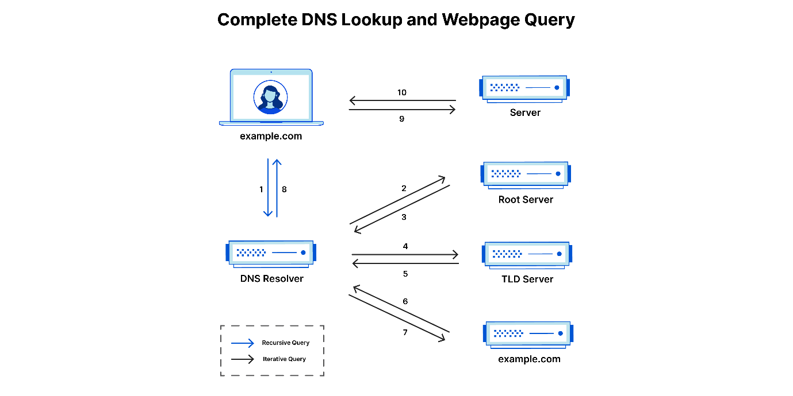



  <h1 style="text-align: center;font-weight: bold">LAPORAN WORKSHOP ADMINISTRASI JARINGAN Tugas 4</h1>
  <h4 style="text-align: center;">Dosen Pengampu : Dr. Ferry Astika Saputra, S.T., M.Sc.</h4>

 

  
  <h3 style="text-align: center;">Disusun Oleh :  Kelompok 1</h3>
  

    <strong>Mahendra Khibrah Rabbani Sayyid (3122500013)</strong> 
    <strong>Akmal Zidani Fikri (3122500019)</strong> 
    <strong>Bagus Bimo Prakoso (3122500028)</strong>
  

<h3 style="text-align: center;line-height: 1.5">Politeknik Elektronika Negeri Surabaya Departemen Teknik Informatika Dan Komputer Program Studi Teknik Informatika 2023/2024</h3>

## 1. Tugas Baca tentang Ekosistem Internet (Materi sudah diunggah di Ethol). Tuliskan pendapatmu tentang bagaimana Internet bekerja (tugas pribadi)!

Internet

- **Internet pada sisis teknis**

  Internet terbagi jadi dua yaitu routing system dan naming system. Routing system dimana terdapat alamat-alamat berbentuk angka yang dikenal sebagai alamat ip. Selayaknya jalan, alamat ip terhubung satu sama lain sehingga komunikasi tidak terbatasi. Naming system merupakan alias dari alamat ip, karena alamat ip susah dihafal maka muncul naming system dinama memberikan nama alias atau domain terhadap alamat ip

- **Internet pada arsitektur**

  Internet bersifat umum atau kepemilikan bersama. karena dapat dimiliki oleh global, maka diperlukan standarisasi dan rancangan arsitektur yang solid. Hingga sekarang, arsitektur dari internet terus disempurnakan oleh organisasi independen.

- **routing**

  Selayaknya jalan dan tempat tinggal, internet juga memiliki alamat-alamat yang bisa dikunjungi. Alamat ini saling terhubung satu sama lain atau juga bisa disebut jaringan di dalam jaringan. Satu jaringan tersusun oleh berbagai alamat, dan jaringan terhubung dengan jaringan yang lain. Terdapat berbagai jenis koneksi internet.

1. Peering connection

   Konsep dimana setiap alamat terhubung melalui provider, provider lah yang mencarikan alamat lain di jaringan tersebut. Ketika sudah berbeda jaringan, maka provider akan meneruskan ke transit agar bisa terhubung dengan provider lain. Selain itu, ada lagi yang bernama settlement free dimana tidak perlu melewati jalur transit dan provider untuk bisa terhubung dengan alamat lain,

1. Edge provider routing policy

   Alamat yang memberikan paketnya kepada penyedia layanan untuk meneruskan ke alamat tujuan. Disini juga ada istilah hot potato routing, selayaknya memegang kentang panas, akan diberikan ke yang lain secepat mungkin. Ini berguna agar paket tidak membebani jaringan dari penyedia layanan.

1. Transit provider routing policy

   Ini merupakan penyedia layanan transit dimana terhubung dengan jaringan lain, terdapat kemungkinan paket tidak langsung diberikan ke alamat tujuan, namun disalurkan ke penyedia layanan lain. Ini memungkinkan bisa memilih rute tercepat. Meski terlihat bahwa paket mengunjungi beberapa penyedia layanan, namun bisa jadi lebih cepat karena pemilihan rute dan traffic nya.

1. Content Provider Routing policy

   Penyedia layanan yang menyediakan konten. Ini berkaitan erat dengan cdn, dimana tersebar berdasarkan geografis guna dapat menyalurkan konten sedekat mungkin dengan pengguna agar pengiriman lebih cepat.

- **Naming System**

  Naming system berguna untuk translasi nama alias ke alamat ip ataupun sebaliknya. Terdapat 2 jenis dns yaitu authoritative dan non authoritative.

  Authoritative artinya server ini memang menaungi alamat-alamat ip didalamnya sedangkan non-authoritative adalah server yang memberikan jawaban atas alamat ip yang tidak dalam naungannya.

- hirarki

  Pada penaamaan alamat ip, terdapat hirarki yang mengoorganisir dari banyak nama. Ini disebut domain

- RR Type

  jenis catatan tertentu yang memberikan kode pada hubungan antar domain dan alamat ip. Sperti contohnya adalah A yang mana menghubungkan domain ke alamat ip, dan ptr yang menghubgunkan alamat ip ke domain.

- **Lembaga standarisasi**

  Lembaga atau organisasi yang meregulasi atau memberikan standar umum terhadap arsitektur internet. Terdapat berbagai macam aspek yang terstandarisasi seperti contohnya protokol routing, layer pada osi atau tcp/ip, bahasa, enkripsi, dan yang lainnya. Contoh dari lembaga ini adalah :

1. Ietf : lembaga yang mengurus standarisasi dari layer 3 transport dan routing. Ietf melakukan standarisasi terhadap ip, tcp, udp, htpp, telnet dan yang lainnya.
1. Ieee : lembaga yang mengurus layer 1 dan 2. Lembaga ini mengurus seperti ethernet dan yang lainnya.
1. W3c : lembaga yang mengurus mengenai bahaca markup. Seperti html dan xml
1. Itu : mengurus standarisasi internasional meliputi numbering, dan skema enskripsi.

- **Service Provider**

  Terdapat berbagai penyedia layanan pada internet.

1. Content provider : menyediakan layanan berupa konten seperti google sebagai mesin pencarian, dan netflix penyedia konten hiburan.
1. Access provider : menyediakan layanan untuk menghubungkan pengguna ke internet. Contohnya adalah indihome yang menyediakan layanan menyambung internet di rumah-rumah, dan indosat yang menghubungkan internet dari handphone.
1. Transit provider : menyediakan layanan untuk koneksi dari servis konten dengan servis akses.
1. Internet exchange point : sama seperti transit provider, namun dalam skala lokal guna menghindari penggunaan transit di luar region.

- **Registries**

  Authority : Yang mengatur blok dan distribusi alamat. Lembaga yang mengurusnya adalah ICANN dan IANA.

  Regional Internet Regisries : lembaga yang mengatur distribusi dan organisasi alamat ip pada lingkup benua.

  Selain itu registries mengatur tingkatan dari domain. Ada beberapa tingkatan yang tiap tingkatannya diatur oleh organisasi.

1. Top level domain : seperti .com, .org, dan yang lainnya. Ini diatur oleh ICANN
1. Second Tier : membeli domain di top level dan menjualnya kembali sesuai dengan popularitasnya. Contoh organisasi yang bergerak disini seperti hostinger, domainesia, dan go daddy.

- Clearing House

  Sistem yang mengatur mengenai pertukaran data seperti transaksi, persengketaan, dan penyelarasan traffic.

## 2. Bagaimana Cara kerja dari iterative dan recursive dari DNS Query, ada 8 step, dari PC anda!

### Misal dari BBC.com

**1. Pengguna mengetikkan alamat \"bbc.com\" di browser.**

**2. Browser mengirimkan permintaan DNS ke resolver DNS lokal yang
terhubung ke internet.**

**3. Resolver DNS lokal tidak memiliki informasi alamat IP untuk
\"bbc.com\", sehingga memulai proses pencarian.**

**4. Pencarian Iteratif:**

- Resolver DNS lokal bertanya kepada salah satu dari 13 root server
  global.

- Root server memberikan informasi tentang server TLD (Top-Level
  Domain) yang bertanggung jawab atas \".com\".

**5. Pencarian Rekursif:**

- Resolver DNS lokal kemudian bertanya kepada server TLD \".com\".

- Server TLD \".com\" memberikan informasi tentang server DNS yang
  memiliki informasi tentang \"bbc.com\".

- Resolver DNS lokal kemudian bertanya kepada server DNS yang
  disediakan oleh registrar domain bbc.com.

**6. Server DNS bbc.com memberikan alamat IP untuk bbc.com.**

**7. Resolver DNS lokal menerima alamat IP dari server DNS bbc.com.**

**8. Resolver DNS lokal meneruskan alamat IP ke browser.**

**Penjelasan Singkat:**

- **Resolver DNS lokal:** Perantara yang menerjemahkan nama domain
  seperti \"bbc.com\" ke alamat IP.

- **Root server:** Server yang menyimpan informasi tentang server TLD.

- **Server TLD:** Server yang bertanggung jawab atas domain tingkat
  atas seperti \".com\".

- **Server DNS registrar:** Server yang menyimpan informasi tentang
  nama domain dan alamat IPnya.

**Sumber:** <https://www.cloudflare.com/learning/dns/what-is-dns/>

## Parafrase Analogi Pencarian Alamat Situs Web

**Analogi:**

Proses mencari alamat situs web bbc.com diibaratkan seperti mencari
alamat rumah seseorang di kota yang tidak pernah Anda kunjungi
sebelumnya.

**Langkah-langkah:**

**1. Permintaan Awal:**

- Inginkan kunjungi rumah seorang teman di kota yang tak dikenal.

- Hanya punya nama teman (bbc.com) tanpa tahu alamatnya (alamat IP).

**2. Pertanyaan Pertama:**

- Tanyakan kepada penduduk kota.

- Mereka tidak tahu alamat teman, tapi arahkan ke pusat informasi kota
  (root server) untuk info lebih lanjut.

**3. Pusat Informasi Kota (Root Server):**

- Di sana, petugas arahkan ke wilayah yang relevan (TLD server).

**4. Wilayah (TLD Server):**

- Pergi ke wilayah sesuai petunjuk.

- Tanyakan penduduk di sana.

- Mereka arahkan ke institusi terkait (DNS server yang mengelola
  domain \".com\").

**5. Kantor Polisi (DNS Server .com):**

- Di sana, diberitahu untuk langsung tanyakan keluarga teman (DNS
  server bbc.com).

**6. Rumah Teman (DNS Server bbc.com):**

- Di sana, anggota keluarga berikan alamat lengkap teman.

**7. Kembali ke Anda:**

- Kembali dengan alamat lengkap yang diberikan oleh keluarga teman.

**8. Tiba di Rumah Teman:**

- Kunjungi teman dengan alamat yang diperoleh dan tiba di rumahnya.

## 3. Ikuti langkah-langkah instalasi DNS server dengan menggunakan aplikasi BIND9 pada Debian 12 anda [BIND9-debian-wiki](https://wiki.debian.org/Bind9#Debian_Bookworm)

Proses intalasi paket yang diperlukan

Bind9 → paket utama untuk menyediakan dns server

Bind9-doc → paket yang berisikan dokumentasi mengenai bind9

Bind9-dnsutils → paket yang berisikan utils untuk mengelola bind9 salah satunya nslookup

Konfigurasi utama bind9 yang ada di /etc/bind

Acl internals {} untuk memberikan akses kontrol pada dns server secara internal pada ip tertentu.

Controls {} digunakan untuk memberikan akses pada ip dan port tertentu untuk mengakses dns dari eksternal

Didalam konfigurasi utama, memanggil juga konfigurasi lainnya yaitu options local dan default zone

Pada konfigurasi options mengatur izin seperti allow query dan recursion. Pada kasus ini izin diberikan kepada internals yang ada di named.conf sebelumnya.

Untuk listen-on untuk mengatur mana koneksi alamat ip yang didengar

Pada file konfigurasi conf.local mengatur zone file yang kita simpan. Contoh pada gambar adalah mengatur zone file kelompok1.local sebagai domain name yang ada pada file di /var/lib/bind/db.kelompok1.local, begitu juga alamat ip terbalik.

Cek apakah konfigurasi ada error atau tidak, jika tidak ada maka error tidak ditemukan

Pada /var/lib/bind buat file db sesuai yang sudah ada di konfigurasi zone file sebelumnya. Contoh diatas adalah db.kelompok1.local

Ini adalah isi dari file kelompok1.local

Menyimpan serial dimana best practice nya adalah tahunBulanTanggalVersi

Di file ini mengambil dari host ns.kelompok1.local.

Untuk address nya menuju pada alamat ip 192.168.1.1

Untuk www dan mail kita aliaskan sama untuk ns

Ini adalah isi dari file kelompok1.local.inv

Disini menyimpan alamat ip, pada kasus ini adalah 1 yang mengarah ke (pointer to) ns.kelompok1.local.

` `

Named-checkzone adalah utils yang digunakan untuk mengecek apakah konfigurasi sudah benar.

Pada kasus ini domain name dicek apakah sudah benar, jika status ‘OK’ artinya sudah terkonfigurasi dengan benar. Begitu pula untuk alamat ip 192.168.1

Setelah itu konfigurasi file /etc/resolv.conf

Ini adalah konfigurasi untuk sistem dns pada linux

Pada kasus ini ketika search kelompok1.local maka akan mencari ke nameserver utama 192.168.1.1, jika tidak merespons atau tidak ada maka akn mencari di alamat ip cadangannya yaitu 2 baris bawahnya.

Restart konfigurasi bind9 pada named.conf, lalu lihat statusnya, jika active artinya sudah berjalan

cek menggunakan sudo netstat -ptlun untuk melihat apakah port dns 192.168.1.1 (53) sudah terbuka. Jika ada artinya sudah terbuka

Menggunakan perintah nslookup dan dig untuk memerika apakah dns server bisa mememberi jawaban. Pada kasus ini kelompok1.local memiliki ip 192.168.1.1
